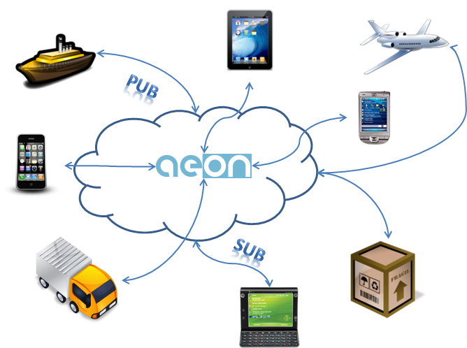

.. AEON documentation 

|
.. figure::  images/web_header_medium.png
   :width: 40%
   :align:   center
|  
   
This document describes AEON as a cloud platform to create applications with real time communications channels.  The architecture is based on the strongly communication needs that we need to face nowadays, with billions of interconnected devices and short times of response. Thus, the technological solutions used for the implementation are based on strong requirements about: performance, response and scalability, making use of the most advanced cutting edge technologies. 

Due the interoperability needs of these architectures, AEON has been fully designed considering Free Libre Open Source Software technologies. The project has been designed and implemented by the “Supply Chain Sector in the Research & Innovation department in ATOS Spain”.

AEON aims to facilitate real time communication. It borns from the strong need to be (always) interconnected, whether personal reasons or business needs. We are constantly exchanging information trough different applications: emails, instant messaging, location, etc, not caring about the amount of information or the receptor's location. These applications are supported by a communication network, but, which infrastructure is being used? Who is the owner? What if I have similar communication needs than WhatsApp? 

.. note::

    AEON facilitates to create and manage communications channels. Later, these channels will support the development of application with real time requirements for communications.

What does real time communications means?
------------------------------------------

What does “Real Time Communication Infrastructure” means? In our current technological stage, the amount of information that it is going to be created during the `next five minutes <http://www.visualnews.com/2012/06/19/how-much-data-created-every-minute/>`_ , in the computing world, is almost impossible to be calculated: Facebook generates `2.5B likes by day <http://techcrunch.com/2012/08/22/how-big-is-facebooks-data-2-5-billion-pieces-of-content-and-500-terabytes-ingested-every-day/>`_ , FourSquare receives `5M checking <http://articles.businessinsider.com/2011-08-02/tech/30097137_1_foursquare-users-merchants-ins>`_ (user’s locations) each day. This situation converges to the need of new infrastructures where it has no limits about gathering (web services), storing (cloud distributed storage) data, and faster communication channels (event-driven architectures). From a more functional point of view: “Cloud infrastructures which spread web services over the unlimited network, capable of processing millions of request by second, and communications with just a few milliseconds of delay”.  

How does AEON work?
------------------------------------------

AEON provides cloud services (channels) to communicate an unlimited number of entities, interchanging an unlimited amount of information. But it is not only about the communication, it also provides services for easily management of entities participating in your environments: mobile, truck, box, thermometer, even yourself...). 

   
   An interconnected world thanks to AEON
|
In this figure, the upper left ship is “virtualized” into AEON as a new entity with a communication channel. We consider an entity as anything that can participate communicating information. With cloud message queuing, the subscriber to a service does not need to understand the protocol used by the service provider or vice versa but can focus on requesting the required business functionality. AEON platform offers a shared cloud-based message queuing framework enabling messaging between various entities that wish to communicate with each other seamlessly and reliably using standard vendor neutral protocols

Documentation
------------------------------------------

The next chapters will contain detailed information focused on developments with the AEON's platform.
 
.. toctree::
   :maxdepth: 2
   
   apidoc/apidoc

