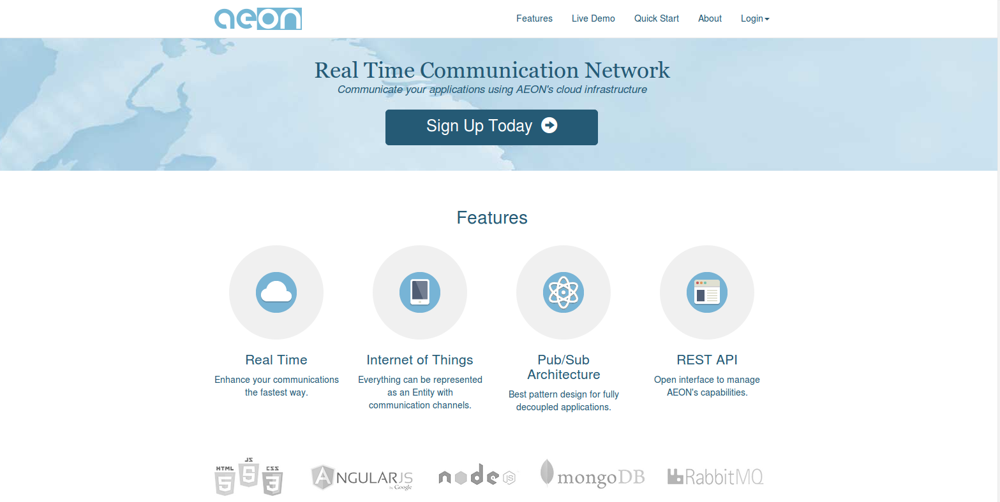
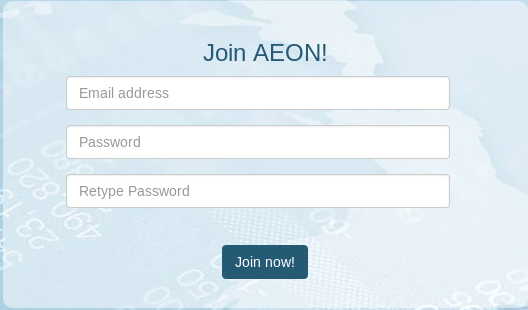
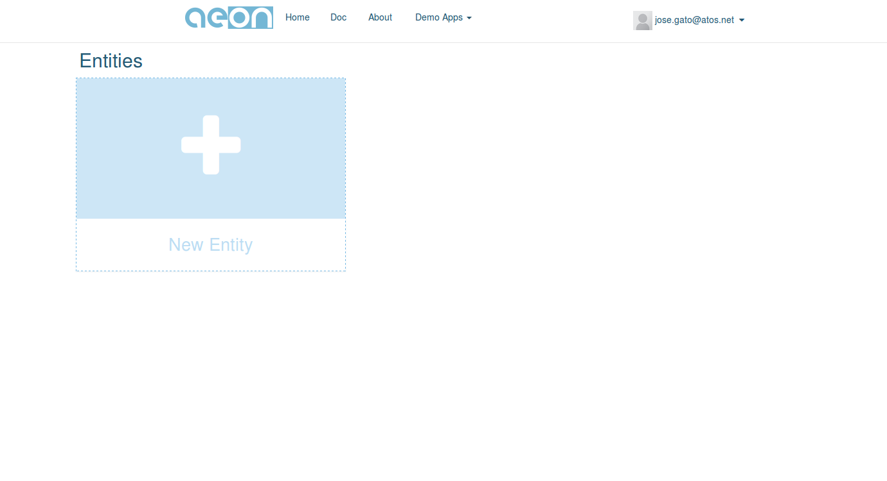
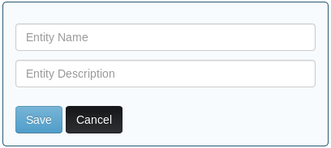
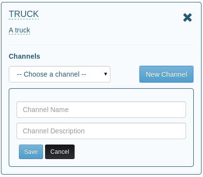
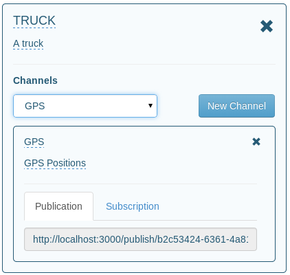

.. include:: ../links.rst

.. _documentation-tutorial-getchannel:

Playing with AEON dashboard
*****************************

Before begin coding with AEON you need to configure your application with at least one communication channel. You can use the :ref:`documentation-technical-rest` to get one, or in a more simple way, you can use the AEON's dashboard_ This section will cover how to use AEON's dashboard to create a channel, which later will be used for your own application. 

|

    
   AEON web page
|

First of all you need to register your user. Each user will be able to create entities and channels.

|

|    

After the registering and login process you will be able to access to your dashboard with an empty list of entities.

|

As explained before, users will be able to create entities. An entity will be whatever you want to transmit information, it could be a person, an object, a country, etc.

|

|

Once the entity has been created you need to create a channel for this entity. Again, you only need to specify a name
and a description. Remember that channels are the most valuable resource, because they allow your applications to publish and subscribe information.

|

|

Finally, you have an entity **truck** with a channel to publish/subscribe **location's information**. AEON simplifies these operations using two urls: one configured for publishing and the other for receiving subscription. Write down the two urls, because they are going to be requested by your aplications using AEON SDK.

|

   
   Publication and subscription urls ready.
|
